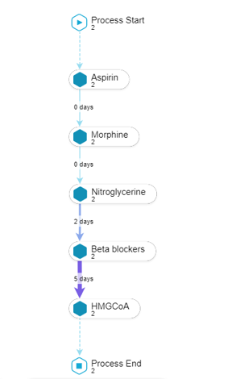
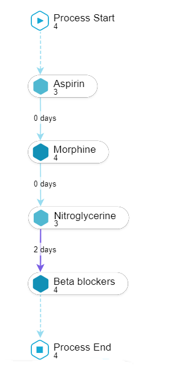

```{r setup, include=FALSE}
## set output options
knitr::opts_chunk$set(echo = FALSE, message = FALSE, warning = FALSE)
options(scipen=999)
source("Global.R")

## load packages
```

# Business Understanding

##  Introduction
Cardiovascular diseases (CVDs), principally ischemic heart disease (IHD) and cardiac stroke,
are the leading cause of  mortality globally and are often associated with poor survival[@roth].

Acute Coronary Syndrome (ACS) is a term given to diverse presentations related to cardic myopathies of quick onset. 
Accurate estimation of risk for untoward outcomes after a suspected onset of an ACS may help clinicians chose the type and intensity of therapy. For example, patients predicted to be at higher risk may receive more aggressive surveillance and/or treatment, while patients predicted to be at lower risk may be managed less aggressively.


#### Problem statement

The establishment of prognosis model for patients with suspected ACS is important in critical care medicine.Numerous risk-prediction models for differing outcomes exist for the different types of ACS. 

These models however have some limitations. First, most models have been developed from large randomized clinical trial populations in which the generalizability to risk prediction in the average clinician's experience is questionable[@Eagle].Second, given the dynamic nature of the treatment environment, predicting future behavior while the treatment is underway may help the clinicians make decisions proactively.


### Project Objectives


1. Developing a risk-prediction machine learning classifier, focusing on clinical end point of all-cause mortality after one hour of treatment(golden hour). The chances of a patient to have good outcomes are usually high if substantive medical attention is given within an hour of the cardiac event[@johnson]. In this study the golden hour cut-off was 60 minutes after initial contact with the hospital. This included all interventions that were done prior to admission.
2. Explanation of the predicted outcome based on the care pathway using process mining. This AHA guideline(ACLS 2020) was was used as the gold standard for ACS clinical pathway [@americanheart]. 

## Project plan

#### Sources of Data and Knowledge
    
##### MIMIC III Database

MIMIC-III is a large, freely-available database comprising deidentified health-related data associated with 46,520  patients who stayed in critical care units of the Beth Israel Deaconess Medical Center between 2001 and 2012.  The database includes information such as demographics, vital sign measurements made at the bedside , laboratory test results, procedures, medications, caregiver notes, imaging reports, and mortality (including post-hospital discharge).

Researchers seeking to use the database are required to :

1. Become a credentialed user on [PhysioNet.](https://physionet.org/) This involves completion of a training course in human subjects research.
2. Sign the data use agreement. Adherence to the terms of the DUA is paramount.

##### The Loin[@loinc] data tables will be used to enrich the laboratory dataset.
##### The British National Formulary (BNF) drug formularly was used to identify the drugs prescribed.

##### American Heart Association guidelines for CPR and ECC  

The AHA guideline[@americanheart] was used to identify the various services used in teh clinical pathwasy in the management of the patients with suspected ACS.


2. A glossary of data mining terminology, illustrated with examples relevant to the business problem in question  

* Check prior availability of glossaries; otherwise begin to draft glossaries
* Talk to domain experts to understand their terminology
* Become familiar with the business terminology

### Inventory of resources

#### Software

For this project the following software will be used:

1. SQL - Database storage and queries.
2. R - Data manipulation, model building.
3. Python - Machine learning modeling
4. Celonis -  Visualization of process 

#### Computing resources 
The analysis was  done on a Windows desktop and a Linux server. [Github repository](https://github.com/em-kagereki/Data-Mining) was used for the CI/CD pipeline.

### Requirements, Assumptions, and Constraints

The  de-identification step used to obstruct identifiable times through random date
shifting is expected to be a limitations in the interpretation of the data.
It is also assumed that:

- The patients in this population were only treated in this hospital, therefore mortality are only captured in this hospital.

- All the pre-hospitalization interventions were captured.

- All the pre-hospitalization interventions were captured.
- The unit of analysis is the admission, and a patient may have multiple admissions.


### Data Mining Success Criteria

Since the  aim of the model was to identify the patients who were at the highest risk of dying, the F-beta score was chosen. It was assumed that misclassification of a patient who survived was less costly as compared to misclassifying  a patient who was at a high risk dying. Therfore the F-beta measure  was used ( set at 2 to give less weight to precision and more weight to recall)

\begin{minipage}[t]{0.5\textwidth}
$$Recall =  \frac{TP}{TP+FN}$$

$$Precision =  \frac{TP}{TP+FP}$$
$$F-score =  2*\frac{Recall*Precision}{Precision+Recall}$$


\end{minipage}
\begin{minipage}[t]{0.5\textwidth}

\begin{table}[]
\begin{tabular}{|l|l|}
\hline
\multicolumn{1}{|c|}{Variable} & Level pf measurement                                                              \\ \hline
Age                            & Includes patient level data per admission                                         \\ \hline
Laboratory                     & All the laboratory services per patient, this was enriched with the LOINC dataset \\ \hline
Procedures                     & All the procedures that were done to the patient during the admission             \\ \hline
Microbiology                   & All the microB that was done                                                      \\ \hline
Prescriptions                  &                                                                                   \\ \hline
Services                       &                                                                                   \\ \hline
\end{tabular}
\end{table}

\end{minipage}


# Data Understanding

## Data collection

Upon gaining access to the MIMIC-III database, all the data was transferred  into a RDMS (relational database management system). This was done with the help of open source scripts[@SpiroGanas].  Subsequently, SQL queries were used to connect and access the data. Although the database includes 26 tables, only the following tables were be included in the analysis:

* **ADMISSIONS:** Contains information regarding a patients admission to the hospital. Information available includes timing information for admission and discharge, demographic information, the source of the admission, and so on. Record of  58,976 unique admissions.
* **PATIENTS:**Defines each patient in the database, i.e. defines a single patient. There are 46,520 patients recorded.
* **SERVICES:**Lists services that a patient was admitted/transferred under.This table contains 73,343 entries.
* **DIAGNOSIS_ICD:**Identify type of data sources (online sources, experts, written documentation, etc.)
* **MICROBIOLOGYEVENTS:**Contains microbiology information, including cultures acquired and associated sensitivities.There are  631,726 rows in this table.
* **PRESCRIPTIONS:**Contains medication related order entries, i.e. prescriptions.This table contains 4,156,450 rows.
* **PROCEDUREEVENTS_MV:**Contains procedures for patients. This table has 258,066 rows.
* **D_ITEMS:** Definition table for all 12,487 items in the ICU databases.
* **D_LABITEMS:** Definition table for 753 laboratory measurements.
The **D_LABITEMS** and **D_ITEMS** tables were not used in teh analysis. 


### Selection criteria

For this analysis only the patients admitted with suspected acute cardiac syndrome were included. In this subset, patients who died within the first hour of treatment were also excluded. The keywords identified for the selection of the patient subset is listed in the Appendix.


## Data exploration

```{r, echo=FALSE}
source("summaryStats.R")

```


The MIMIC III dataset contained   `r nrow(pt[ which(pt$GENDER=='F'), ])` `r round(100*nrow(pt[ which(pt$GENDER=='F'), ])/nrow(pt),2)` female  and 
 %  and  `r nrow(pt[ which(pt$GENDER=='M'), ])` `r round(100*nrow(pt[ which(pt$GENDER=='M'), ])/nrow(pt),2)` male patients. The cumulative incidence of suspected ACS was `r round(100*nrow(biodata)/nrow(pt),2)`%.  The report is summarized in Table 1 below.

```{r,echo=FALSE,message=FALSE,warning=FALSE}
#source("summaryStats.R")
#trial2
```

These data was subset using a total of unique subset of the words as shown below.


In addition the patients were seen over a span of time ranging from `r min(lubridate::date(biodata$ADMITTIME))` to `r max(lubridate::date(biodata$ADMITTIME))`. This temporal distribution is shown in the chart below:

```{r, echo=FALSE}

#dataPlot

```


### Volumetric analysis of data
The total dataset was estimated to be more than 100GBs of data. The selected subset of data tables was about 3.47 GBs.


### Attribute types and values

And see Table \@Table 2.
             


# Data Preparation

Data quality was assessed dimensions of completeness, uniqueness, validity, accuracy and consistency. Any issue picked was addressed in the data cleaning step below. Thereafter, data standardization and dimension reduction was done. 


## Data Cleaning
1. There were no duplicates.
2. Completeness:
- Any treatment offered before admission had missing admission ID(*ADMISSION.HADM_ID*). This was inferred from the patient id (*ADMISSION.SUBJECT_ID*) and treatment period.
- The language(*ADMISSION.LANGUAGE*) and ethnicity (*ADMISSION.ETHNICITY*). These were replaced with "UNKNOWN"
3. Consistency:
- The diagnosis(*ADMISSION.DIAGNOSIS*) provides a preliminary, free text diagnosis for the patient on hospital admission as assigned by the admitting clinician and does not use a systematic ontology. Data cleaning was done by removing unnecessary text and ensuring common acronyms and abbreviations referred to the same diagnosis. 
- The Loinc table was used to identify the actual test.
- British National Formularly (BNF) was used to identify the drugs administered to the patients.


### Derived variables of data

The following derived variables were calculated:

1. Age - The age was computed by subtracting the *DOB* from the *ADMITTIME*. Any figure above 300 was adjusted by subtracting 211, since any age above 300 was ages over 89 had been  shifted such that the patient age appears to be 300 in the database.

2. Splitting of Datetime Features - The following features were extracted from teh *ADMITTIME* feature:
-   Day of the year
-   Week of the year
-   Month
-  Year
-   Hour of day
3. The Length of stay: This was calculated from the previous admissions.

4. Admission cycle: If the patient had multiple admissions, what was the admission cycle in this case.


## Categorical variable encoding

1. Categorical variables with high cardinality: diagnoses, medicine, procedures.
- This target encoding/hash encoding was used.
2. Categorical variables with less cardinality but need to preserve the variance: gender, 
- Frequency encoding was used


Data standardization.


Dimension reduction.

## Dimension reduction

Principal component analysis was used to reduce the dimensionality of the data.

```{r, echo=FALSE,warning=FALSE,message=FALSE, out.width="100%"}
library(ggpubr)

setwd("E:/school/data mining/project/mimic-iii-clinical-database-1.4/mimic-iii-clinical-database-1.4/codes")

data<-read.csv("dataforPCA.csv")
index = createDataPartition(data$HADM_ID, p = 0.80, list = FALSE)
train = data[index, ]
test = data[-index, ]

train_y<-data.frame(train$EXPIRE_FLAG)
train<-train%>%
  select(-HADM_ID,-EXPIRE_FLAG,-ADMITTIME)%>%
  select_if(~!all(is.na(.))) # Remove any column with all 0s

preObj <- preProcess(train, method=c("center", "scale"))
train <- predict(preObj, train)
train<-data.frame(train)

p <- pca(train)

trainPcaPlot<-p$loadings[,1:17]
trainPcaPlot<-cbind(trainPcaPlot,train_y$train.EXPIRE_FLAG)
names(trainPcaPlot)[names(trainPcaPlot) == 'train_y$train.EXPIRE_FLAG'] <- "Outcome"
pcaPlot<-trainPcaPlot %>% 
  mutate(Outcome = ifelse(Outcome==0, "Survived","Died"))%>%
  ggplot(aes(PC1, PC2, color = Outcome)) + geom_point()


horn <- parallelPCA(train)
#horn$n


elbow <- findElbowPoint(p$variance)
#elbow

Ninty<- which(cumsum(p$variance) > 90)[1]


elbow <- findElbowPoint(p$variance)

screePlot<-PCAtools::screeplot(p,
                               components = getComponents(p, 1:20),
                               vline = c(horn$n, elbow)) + 
  geom_label(aes(x = horn$n + 1, y = 50,
                 label = 'Horn\'s', vjust = -1, size = 8)) +
  geom_label(aes(x = elbow + 1, y = 50,
                 label = 'Elbow method', vjust = -1, size = 8))

pcaPlot

screePlot


```


## Final Dataset
The Elbow method suggested `r elbow` components, the `r horn$n` suggested. However, `r Ninty` components (accounting for 90% of variance were however chosen) were selected for further analysis. This was selected after experimentation for the model performance.


## Construction of event logs

* Activities and activity instances: Each event related  to the service offered to the patient as per the AHA care pathway.  

* Time stamp: The time corresponding to the service delivery.


# Modeling

## Data splitting

For the data splitting strategy, 20% of the hospital admissions were reserved to the test set. 

The k-fold cross-validation resampling method was used to create 5  different resamples of the training set which were further split into analysis and assessment sets, producing 5 different performance metrics that were then aggregated. In these re-sampled datasets, 20% of the  hospital admissions were allocated  to the validation set and 80% of the hospital stays to the training set. 

\begin{figure}
\centering
\begin{tikzpicture}[sibling distance=10em,
  every node/.style = {shape=rectangle, rounded corners,
    draw, align=center,
    top color=white, bottom color=blue!20}]]
  \node {All data= `r nrow(biodata)`}
      child { node {Testing $\sim$`r round(nrow(biodata)*0.2,0)`} }
      child { node {Training $\sim$ `r round(nrow(biodata)*0.8,0)`}
      child { node {Sample 1 $\sim$ `r round(nrow(biodata)*0.16,0)`}
      child { node {Training $\sim$`r round(nrow(biodata)*0.128,0)`}} 
      child { node {Validation $\sim$`r round(nrow(biodata)*0.032,0)`} }}
      child { node {.....}}
      child { node {Sample 5 $\sim$ `r round(nrow(biodata)*0.16,0)`}
      child { node {Training $\sim$`r round(nrow(biodata)*0.128,0)`}} 
      child { node {Validation $\sim$`r round(nrow(biodata)*0.032,0)`} }}};
\end{tikzpicture}
\caption{Data splitting algorithm} \label{fig:Data splitting algorithm}
\end{figure}

## Model building and tuning


#### Candidate models

Candidate models were selected from the candidate classification models in a multi step way:

Step 1: A representative model was chosen from the broad categories of classification models:

1. Linear models:Regression model.

2. Tree based models: Random forest.

3. Kernel based model: KNN.

4. Quadratic classification model

4. Neural networks: This was not done due to computational limitations

Results were as below:

Step 2: Other models in the Linear classification models were intoduced: 

Generative models: Naive Bayes, LDA

Discriminative: logistic regression, SVM

These were compare with the earlier categories to pick the best model.


Step 3: Tuning of the best two performers

#### Model building and tuning

Grid search algorithm was used to train multiple  models simultaneously. The parameters for each model were captured and saved.  The area under the recall-precision curve was used to quantify how well the model performs across a continuum of event thresholds .

This was implemented by use of a space-filling design to tune, with 25 candidate models. The random forest is uniformly better across event probability thresholds.


```{r, echo=FALSE,warning=FALSE,message=FALSE, results='hide'}
# https://medium.com/@c3_62722/process-mining-with-python-tutorial-a-healthcare-application-part-3-cc9af986c122#:~:text=Heuristics%20Miner%20(Weijters%3B%20Bogarin%20et,it%20does%20not%20guarantee%20soundness.

```

### Best model Description

The best model was a logistic regression model with the penalty of 0.01 and mixture of 0.5


```{r, fig.asp = 3/4, fig.align = 'center', echo = FALSE, out.width = "100%", dpi= 300, warning = FALSE, message=FALSE}

library(ggpubr)
setwd("E:/school/data mining/project/mimic-iii-clinical-database-1.4/mimic-iii-clinical-database-1.4/codes")

prPlot<-read.csv("logpr.csv", sep=",", h=T)
aucPlot<-read.csv("auc.csv", sep=",", h=T)

auc<-bind_rows(aucPlot) %>% 
  ggplot(aes(x = 1 - specificity, y = sensitivity)) + 
  geom_path(lwd = 1.5, alpha = 0.8) +
  geom_abline(lty = 3) + 
  coord_equal()


pr<-bind_rows(prPlot) %>% 
  ggplot(aes(x = recall, y = precision)) + 
  geom_path(lwd = 1.5, alpha = 0.8) +
  geom_abline(lty = 3) + 
  coord_equal()

ggarrange(pr, auc + rremove("x.text"), 
          labels = c("precision-recall", "AUC"),
          ncol = 2, nrow = 2)

```


# Model explanation

Process discovery was done by the implementation of the  heuristics miner algorithm. 

\begin{minipage}[t]{0.5\textwidth}


\end{minipage}
\begin{minipage}[t]{0.5\textwidth}

\end{minipage}


```{r, echo=FALSE,warning=FALSE,comment=NA}
q2.m = matrix(c(5330,873,3446,312), nrow=2, byrow=T, 
              dimnames = list(c("Alive", "Dead"),c("Asprin", "No")))
#5330,873,3446,312
q2.m
epiR::epi.2by2(q2.m)
```


# Summary

# References


# Appendix

```{r, echo= TRUE, eval=FALSE}

con <- DBI::dbConnect(RPostgreSQL::PostgreSQL(), 
  host = "AWS end point",
  user = "eKagereki",
  password = rstudioapi::askForPassword("Database password")
)

data <- tbl(con, "ADMISSIONS")


```

### Data attibutes and levels of measurements

```{r,dtypes, echo=FALSE }

d<-data.frame(dlookr::diagnose(biodata)) %>% 
  select(-missing_count)
d <- d[!grepl("X|SUBJECT_ID|HADM_ID|ADMITTIME|DISCHTIME|DEATHTIME|DISCHARGE_LOCATION|EDREGTIME|EDOUTTIME|
              DIAGNOSIS|HOSPITAL_EXPIRE_FLAG|HAS_CHARTEVENTS_DATA|DOB|LOS2|Period|endGoldenHour|nAdmissions|
              deadBefore|DIAGNOSIS2|DIAGNOSIS", d$variables),]
#d
knitr::kable(d,
             caption = "Attributes and the level of measurement")
```


### Terms and terminologies used

### Terminology

1. **Acute Cardiac syndrome:** Acute coronary syndrome (ACS) refers to a spectrum of clinical presentations ranging from those for ST-segment elevation myocardial infarction (STEMI) to presentations found in non–ST-segment elevation myocardial infarction (NSTEMI) or in unstable angina. It is almost always associated with rupture of an atherosclerotic plaque and partial or complete thrombosis of the infarct-related artery. Candidates of  acute cardiac syndrome were identified using the *DIAGNOSIS* in the *ADMISSIONS* table which  provides a preliminary. This column was is a free text diagnosis for the patient on hospital admission. The diagnosis was  assigned by the admitting clinician and did use a systematic ontology. Candidate cased were identified by using the key words  commonly used in the diagnosis of acute coronary syndrome and the related differential diagnosis. These were:

*"stemi","acute coronary syndrome","angina","tachycardia","aortic aneurysm","pericardi","ortic dissection","coronary artery dissection","cardiomyopathy","heart failure","mitral valve disease","mitral stenosis","coronary artery disease","chf","congestive heart failure","heart failure","telemetry","myocardial infaction","cardiac arrest","myocardial infarction","aortic stenosis","st elevated","pericardial effusion", "cardiomyopathy","cath lab","tamponade","tamponede"*

```{r, acsKeywords,eval=FALSE,echo=FALSE,results='asis'}

"stemi","acute coronary syndrome","angina","tachycardia","aortic aneurysm","pericardi","ortic dissection","coronary artery dissection","cardiomyopathy","heart failure","mitral valve disease","mitral stenosis","coronary artery disease","chf","congestive heart failure","heart failure","telemetry","myocardial infaction","cardiac arrest","myocardial infarction","aortic stenosis","st elevated","pericardial effusion", "cardiomyopathy","cath lab","tamponade","tamponede"

```


2. Angiotensin-converting enzyme (ACE) inhibitors are medications that help relax the veins and arteries to lower blood pressure. ACE inhibitors prevent an enzyme in the body from producing angiotensin II, a substance that narrows blood vessels. The following terms were used to identify ACE's from the list of *DRUG* column of the *PRESCRIPTIONS TABLE* table: 

*"benazepril", "captopril", "enalapril","enalaprilat","fosinopril", "lisinopril", "moexipril", "perindopril", "quinapril", "ramipril","trandolapril"*

3. Beta blockers (beta-adrenergic blocking agents)

Medications that reduce blood pressure. Beta blockers work by blocking the effects of the hormone epinephrine, also known as adrenaline.The following terms were used to identify Beta blocker from the list of *DRUG* column of the *PRESCRIPTIONS TABLE* table: 
 
*"acebutolol","atenolol","betaxolol","bisoprolol","carteolol","carvedilol","labetalol","metoprolol","nadolol","nebivolol",*
*"penbutolol","pindolol","propanolol","sotalol","timolol"*

4. Glycoprotein IIb/IIIa inhibitors

These drugs are frequently used during percutaneous coronary intervention (angioplasty with or without intracoronary stent placement).
They work by preventing platelet aggregation and thrombus formation.

The following terms were used to identify Glycoprotein IIb/IIIa inhibitors's from the list of *DRUG* column of the *PRESCRIPTIONS TABLE* table: 

*"abciximab","eptifibatide","tirofiban","roxifiban","orbofiban"*

5. P2Y12 inhibitors
*"clopidogrel","prasugrel","ticlopidine","ticagrelor"*
 
6. HMGCoA
*"altoprev","amlodipine","atorvastatin","caduet","crestor","ezallor","fluvastatin","lescol","lipitor","livalo","lovastatin","mevacor","pitavastatin","pravachol","pravastatin","rosuvastatin","simcor","simvastatin","simvastatin","ezetimibe","simvastatin","niacin","vytorin","zocor","zypitamag"*


